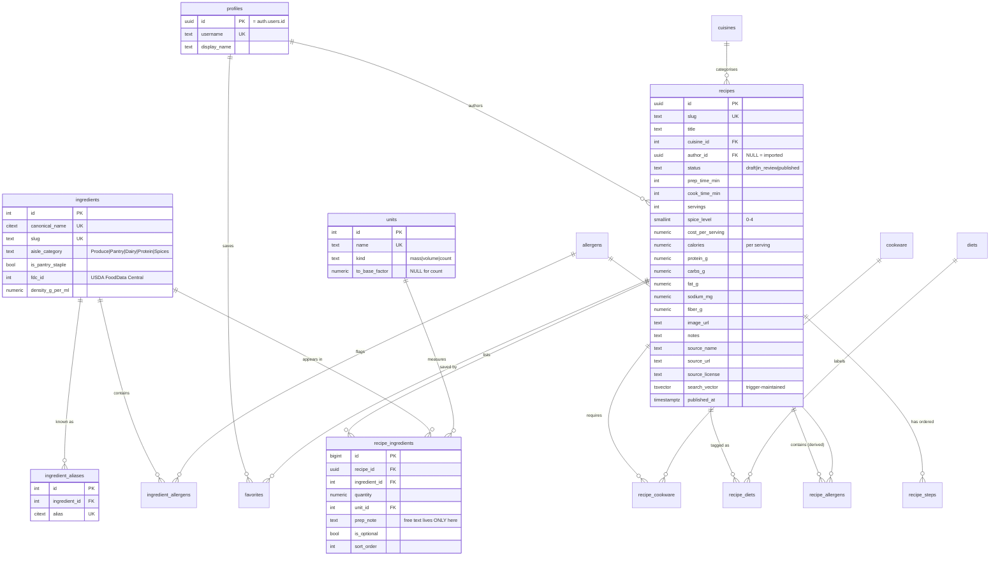

# Mise — Schema Notes

> **What this file is:** the schema designed on paper, before any SQL. `BUILD-PLAN.md` M1.1 requires it, M1.2 implements it.
> **Why it exists separately from the migration:** a migration tells you *what* the tables are. This tells you *why*, and what we rejected. Once there's data in the database, changing shape is expensive — so the argument gets written down before the code.
> **Status:** designed 2026-08-27. Not yet implemented.

---

## The five questions M1.1 asks

Answered up front; the reasoning is in the table sections below.

**1. A recipe has many ingredients, each with a quantity and unit — why a join table, not a text column?**

Because every question the product asks is impossible against text. `"2 cloves garlic, 1 onion"` can't answer "recipes without nuts" (`LIKE '%nut%'` also matches *nutmeg*, *butternut squash*, *coconut* — and a false negative here serves a nut-allergic user a recipe with nuts), can't answer "what's in my pantry" (`scallion` ≠ `green onion` to Postgres), and can't scale to 6 servings without parsing English.

A join table gives each ingredient its own identity:

```
recipes ──< recipe_ingredients >── ingredients
(the dish)   (qty, unit, prep)      (the thing itself)
```

`recipe_ingredients` holds what's true about *this ingredient in this recipe* — quantity, unit, "finely minced". The word `garlic` is stored **once** and every recipe points at that row. That's normalisation: each fact lives in exactly one place. "Recipes without nuts" becomes an integer comparison against an index — exact and fast — and "green onion → scallion" is fixed once, in `ingredient_aliases`, for the entire catalog.

**2. Is `garlic` a shared row or free text?** Shared. Free text lives only in `recipe_ingredients.prep_note` and never affects matching. This is a CLAUDE.md rule, and the pantry matcher is the reason for it.

**3. Nutrition — stored or computed?** Stored per recipe for v1, as columns on `recipes`, per serving. Computing it correctly needs per-ingredient USDA data we don't have until M1.5.4. When we do, the pipeline writes into the same columns and nothing downstream changes.

**4. Cookware, diet, allergens, cuisine — one generic `tags` table or separate tables?** Separate tables. See *Decision 1*.

**5. What does a user's own recipe look like?** A row in the same `recipes` table with `author_id` set. One query powers browse, one detail page serves both. Imported recipes have `author_id = NULL`, which also means RLS can't let anyone edit them — see *Decision 5*.

---

## ERD



---

## Tables, and why each one exists

### `profiles`
Mirrors `auth.users`, which Supabase owns and we don't alter. `id` is both PK and FK to `auth.users(id)`. Anything user-facing (username, display name) goes here, because a foreign key from `recipes` to a table we control is safer than one into Supabase's auth schema.

### `recipes`
The centre of everything. Both doors — pantry matcher and search — return rows from here, and one detail page renders them all.

Column choices worth defending:

- **`slug`** — URLs are `/recipes/cacio-e-pepe`, not `/recipes/8f3e...`. Unique, immutable once published.
- **`prep_time_min` + `cook_time_min` separately.** The mockup shows one number (`time:24`), but "20 min prep, 4 min cook" and the reverse are very different weeknight propositions. Store both, display the sum. Splitting later means re-deriving data we threw away.
- **Nutrition as six columns, per serving.** Rejected a 1:1 `recipe_nutrition` table and a key/value `recipe_nutrients` table. Every macro filter in M3.4 is a range scan on the hot path; columns keep it a plain `WHERE` with no join and no pivot. The cost is that adding a seventh nutrient is a migration — acceptable, because the six here (calories, protein, carbs, fat, sodium, fibre) are exactly what the mockup displays and what the filters offer. If v1.2 nutrition tracking needs arbitrary micronutrients, add the EAV table *then*, for that purpose.
- **`spice_level smallint CHECK (0..4)`** — the mockup's `spiceDots` renders 4 dots.
- **`status`** as an enum `draft | in_review | published`. `in_review` exists now because M1.5.6 needs an admin review queue; adding an enum value later is a migration, and this one is free today.
- **`author_id` nullable.** NULL means imported (USDA, or Mise-authored via the generation pipeline). This is load-bearing for RLS — see *Decision 5*.
- **`source_name`, `source_url`, `source_license`.** CLAUDE.md forbids importing from any source without a confirmed commercial-storage licence. Recording provenance *per recipe* is what makes that auditable — and what lets us delete exactly the affected rows if a licence turns out to be wrong. A rule you can't verify after the fact isn't a rule.
- **`search_vector`** — maintained by trigger, not `GENERATED`. See *Gotcha 2*.

### `recipe_ingredients`
The join table. One row per ingredient-in-a-recipe.

- **`quantity numeric`, nullable.** Nullable because "salt, to taste" is real. `numeric` not `float` — 0.5 tsp must not accumulate binary rounding error when scaled to 6 servings.
- **`prep_note`** — `"finely minced"`, `"drained"`, `"6 oz each"`. The *only* free text about ingredients, and it never touches matching.
- **`sort_order`** — display order. The mockup's ingredient list is deliberately ordered; without this it renders in whatever order Postgres returns. Named `sort_order` rather than `position` because `POSITION` is a reserved SQL keyword and would need quoting forever.
- **`is_optional`** — "optional garnish" shouldn't count against you in the pantry matcher.
- **No unique constraint on `(recipe_id, ingredient_id)`.** See *Gotcha 1*. This is the one most likely to be "fixed" by someone later and quietly break scoring.

### `ingredients`
The canonical list. One row per real-world ingredient, shared by every recipe.

- **`is_pantry_staple`** — salt, pepper, water, oil, butter, sugar, flour. Excluded from "you're missing". CLAUDE.md is blunt about this: forget it and every match reports missing items and the product feels broken on day one.
- **`aisle_category`** — `Produce | Pantry | Dairy | Protein | Spices`, taken from the mockup's `cat` field. It sits on the *ingredient*, not on `recipe_ingredients`, because garlic is produce in every recipe. Groups the v1.1 shopping list by aisle.
- **`fdc_id`** — the USDA FoodData Central id, for M1.5.4. Nullable until then.
- **`density_g_per_ml`** — nullable. The bridge between volume and mass; see *Gotcha 3*.

### `ingredient_aliases`
`green onion → scallion`, `spring onion → scallion`, `garbanzo → chickpea`. `citext` so case never matters. This table is what makes the M3.3 autocomplete able to offer "scallion" when the user types "green oni", and it's why M1.5.1 comes before every importer in the plan: unresolved aliases don't error, they silently shrink your match rate.

### `units`
`(name, kind, to_base_factor)` — `tbsp` is volume, factor 14.79 → ml; `g` is mass, factor 1 → g; `clove` is count with a NULL factor.

A NULL factor is correct, not missing data: cloves don't convert to millilitres. Code must treat count units as un-summable across different units rather than assuming a conversion exists.

### `recipe_steps`
`(recipe_id, sort_order, instruction)`. Rejected storing steps as a `text[]` or JSON blob on `recipes`: an ordered table costs nothing extra and leaves room for per-step timers and per-step images, which every mature recipe app eventually wants.

### `cuisines`, `diets`, `cookware`, `allergens` + their join tables
Four lookup tables, three join tables (`recipe_diets`, `recipe_cookware`, `recipe_allergens`), and `cuisine_id` as a direct column on `recipes`. See *Decision 1*.

### `ingredient_allergens`
`soy sauce → {soy, gluten}`. The source of truth for allergens. See *Decision 2*.

### `favorites`
`(user_id, recipe_id)`, composite PK — which both prevents double-favouriting and gives the index for "my favourites" for free. Phase 4, but the shape is settled now so RLS can be written once in M1.3.

---

## Decisions, and what we rejected

### Decision 1 — Four separate lookup tables, not one generic `tags` table

**Chosen:** `cuisines` (as an FK column on `recipes`), plus `diets`, `cookware`, `allergens` each with their own join table.

**Rejected:** a single `tags(id, type, name)` with one `recipe_tags` join. It's less SQL and one autocomplete covers everything.

**Why we didn't:** the four facets don't behave alike, and the generic table hides that.

| Facet | Cardinality | Filter semantics |
|---|---|---|
| Cuisine | exactly one | equality; also the M3.7 landing pages |
| Diet | many | *has* this tag |
| Cookware | many | *has* this tag |
| Allergen | many | ***excludes*** — inverted, and safety-critical |

A generic table lets a recipe have three cuisines, which is meaningless, and makes the allergen exclusion look like every other filter when it is the one people get wrong. Separate tables make each constraint expressible in the schema itself rather than in a convention someone has to remember.

The cost is honest: adding a fifth facet later means two new tables instead of a row. We accept that — new facets are rare and the four we have are the four the mockup filters on.

### Decision 2 — Allergens live on ingredients, materialised onto recipes

**Chosen:** `ingredient_allergens` is the truth. `recipe_allergens` is a **derived cache**, refreshed by trigger whenever a recipe's ingredients change.

**Rejected:** tagging allergens directly on each recipe (what the mockup does: `allergens:['Fish','Soy']`). It matches the design spec exactly and needs no trigger.

**Why we didn't:** it's a human-maintained claim, and the failure is silent and harmful. Soy sauce contains **gluten** as well as soy — miss that on one recipe out of 1,500 and a coeliac user is served it with no error anywhere. Deriving from ingredients means an importer *cannot* forget: tag `soy sauce` once and every recipe using it is correct forever.

**Also rejected:** deriving at query time with no cache — always correct, never stale, but it puts a `NOT EXISTS` correlated subquery on the hot path of both doors.

Materialising gets query-time speed with import-time correctness. The trigger is the price, and staleness is the risk to test for in M1.3's test plan.

### Decision 3 — A `units` table with conversion factors

**Chosen:** `units(name, kind, to_base_factor)`, referenced by `recipe_ingredients.unit_id`.

**Rejected:** a plain `text` unit column, exactly as the mockup has it.

**Why we didn't:** three features need to *add* quantities, and text can't be added. The v1.1 shopping list must merge `2 cloves garlic` from one recipe with `3 cloves` from another. Serving-scaling must turn `1 tbsp + 2 tsp` into something sensible. And the v1.4 meal planner's entire cost objective depends on summing what you buy.

Adding this later means backfilling every `recipe_ingredients` row and re-parsing free text we'd already normalised once. It's cheap now and expensive at 1,500 recipes.

### Decision 4 — Nutrition per **serving**, not per recipe

The mockup's `cal:520` alongside `servings:4` is per serving. Stored that way, consistently, because every filter the user sets ("under 600 calories") means per serving. The alternative — store totals, divide on read — puts a division in every query and one place to forget it.

**Consequence to remember:** the serving-scaling UI must scale *ingredients* and leave nutrition alone. Nutrition per serving doesn't change when you cook more servings.

### Decision 5 — Imported recipes have `author_id = NULL`

Not a system user row. NULL is what makes M1.3's rule — *a user may modify only rows where `author_id = auth.uid()`* — automatically true for the entire imported catalog, since `NULL = anything` is never true in SQL. Admin edits go through the service role, server-side only.

---

## Gotchas to carry into M1.2 and M1.3

**1. A recipe can list the same ingredient twice — and that breaks the matcher's arithmetic.**

"1 tbsp olive oil for the pan, 2 tbsp for the dressing" is two legitimate `recipe_ingredients` rows with the same `ingredient_id`. Therefore:

- **No** `UNIQUE (recipe_id, ingredient_id)` constraint. It looks obviously correct and would reject real recipes.
- The M3.3 sketch's `count(*) filter (...)` must become **`count(DISTINCT ri.ingredient_id) filter (...)`**. As written, a recipe listing oil twice counts oil twice toward both *have* and *needed*, and its coverage ratio comes out wrong.

**2. `search_vector` cannot be a `GENERATED` column.**

M3.5 asks for a generated `tsvector` combining title (weight A), **ingredient names** (weight B), and cuisine/diet (weight C). Postgres generated columns may only reference *the same row* and must be immutable — pulling names from `ingredients` and `recipe_ingredients` is neither. It has to be a plain `tsvector` column maintained by a trigger on `recipes`, `recipe_ingredients`, and `recipe_diets`, or a materialised view.

Worth knowing before M3.5, because `GENERATED ALWAYS AS (to_tsvector('english', title)) STORED` *does* compile — it just silently indexes titles only, and ingredient search quietly fails to work.

**3. Volume ↔ mass needs the ingredient, not just the unit.**

`to_base_factor` converts tbsp → ml and oz → g, but **not ml → g**. A tablespoon of honey and a tablespoon of flour weigh different amounts. That crossing requires `ingredients.density_g_per_ml`, which is why the column exists and why it's nullable. Code must refuse to convert across `kind` when density is absent rather than guessing.

**4. Cursor pagination needs a stable, unique sort key.**

CLAUDE.md mandates cursor-based pagination. Cursors must sort on something unique and non-changing — `(published_at, id)`, never `published_at` alone. Ties on a non-unique column make rows repeat or vanish across pages.

**5. `citext` for anything a human types.**

`ingredients.canonical_name` and `ingredient_aliases.alias` are `citext`. `Scallion` and `scallion` must collide on the unique index, or duplicates accumulate and match rates drop silently. Requires `CREATE EXTENSION citext`.

---

## Indexes M1.2 should create (and what each is for)

| Index | Serves |
|---|---|
| `recipe_ingredients (ingredient_id)` | the pantry matcher — the single hottest lookup in the product |
| `recipe_ingredients (recipe_id)` | rendering a recipe's ingredient list |
| GIN on `recipes.search_vector` | M3.5 full-text search |
| GIN trigram on `ingredients.canonical_name` | autocomplete: "green oni" → scallion |
| GIN trigram on `ingredient_aliases.alias` | the same, via aliases |
| `recipes (status, published_at DESC, id)` | browse + cursor pagination, published only |
| `recipes (cuisine_id)` | M3.7 ingredient/cuisine landing pages |
| composite on macro columns | deferred — add after `EXPLAIN ANALYZE` shows a need, not before |

Extensions required: `citext`, `pg_trgm`.

---

## Open questions, deliberately deferred

- **Recipe images.** `image_url text` for now; the mockup uses placeholder descriptions (`photo:'salmon fillet, glazed'`). Supabase Storage vs. a CDN is a Phase 2 decision and doesn't change these tables.
- **Ingredient substitutions** ("no buttermilk → milk + lemon"). Real feature, no table yet. Would be `ingredient_substitutions(from_id, to_id, ratio, note)`.
- **Ratings and reviews.** Not in the MVP. Would attach to `recipes` cleanly; nothing here blocks it.
- **`ingredient_packages`** (price + package size) for the v1.4 meal planner. Deliberately not built now — the planner is Phase 7 and the price data is a sourcing problem, not a schema problem. Noted so nothing here rules it out.

---

## Implementation notes added during M1.2

Verified by applying the migration to a throwaway Postgres 16 container with a stubbed `auth` schema, then exercising each trigger and constraint.

- **`NEW` is unassigned during `DELETE`, and `coalesce()` does not save you.** `coalesce(new.recipe_id, old.recipe_id)` raises *"record new is not assigned yet"* — the field access fails before `coalesce` ever runs. Every trigger here branches on `tg_op` instead. The allergen-sync triggers would have failed on any ingredient removal.
- **Bulk-import performance.** `recipe_ingredients` has row-level `AFTER` triggers, so inserting a recipe with 10 ingredients recomputes its search vector 10 times. Fine for the 6 seed recipes; revisit before M1.5.3 imports ~1,000 recipes — either statement-level triggers with transition tables, or `alter table ... disable trigger` around the load followed by one rebuild pass.
- **`recipes_published_has_date` is effectively unreachable**, because the `BEFORE` trigger fills `published_at` in whenever status becomes `published`. Kept as a backstop if that trigger is ever dropped.
- **RLS is enabled on all 16 tables with zero policies**, which denies everything to the publishable key. Policies are M1.3. This is deliberate: RLS off plus a public key means the entire database is readable and writable by anyone in the window between the two milestones.
